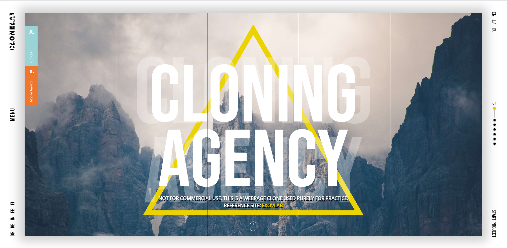
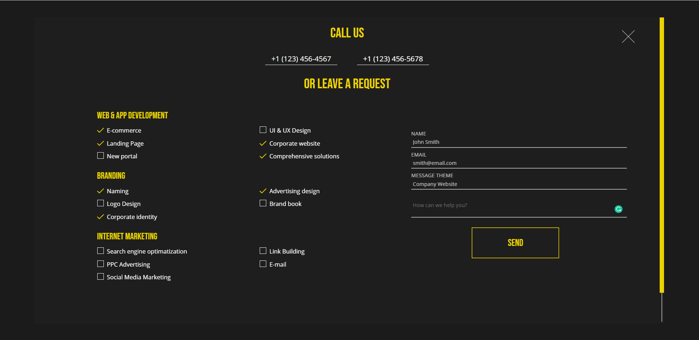
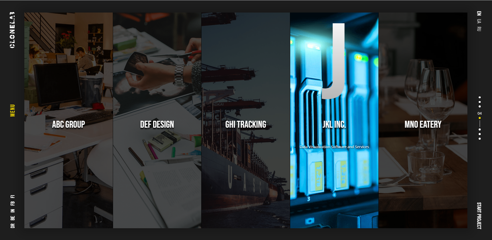

# React - Landing Page Clone

This application is created solely to practice creating responsive landing pages
with [Evoxlab](https://evoxlab.com/#home) as reference. Not for commercial use.

[Live Link]()

---

## Screenshots

---

### The purpose of this project is to learn and gain practice with:

-  React framework
-  Sass
-  Animations
-  Responsive Design

---

### Built with:

-  React
-  Sass
-  Framer-Motion
